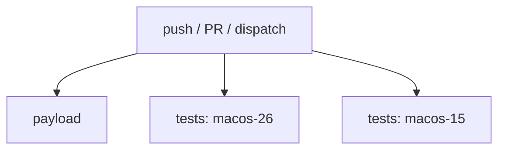

# The prose companion beside the workflows

The YAML states the steps. It states why those are the steps nowhere, and that
gap is the whole reason this document exists. Every way these documents fail is
a drift across it — a section that restates `runs-on: ubuntu-latest` is worse
than no section, because it reads as current long after it stops being true.

## The directory decides

**Where a repository keeps no companion doc, say so and stop.** Do not create
one, do not propose one as a side effect of an audit, and do not offer to
generate it from the YAML — a document generated from the workflow restates
shape, which is the one thing the workflow already says. These are worth having
only where someone chose to keep one.

There is no global fallback here, unlike a spec or a lore note. A companion
filed away from the thing it companions is unreachable by the people who needed
it, so it is not worth writing.

## Two tiers

```
.github/
  workflows/
    README.md        # the map — every workflow, one row each
    release.md       # one workflow's depth
    tests.yml
    release.yml
  actions/
    cache-build/
      action.yml
      README.md      # the action's own doc; GitHub renders this file
```

This is the same split as a `SKILL.md` and its `references/`: the top level
carries what is always needed, the spokes carry what is needed once you are
inside one workflow.

| `workflows/README.md` owns | `workflows/<name>.md` owns |
| --- | --- |
| Which workflows exist and what each proves, one row apiece | That workflow's jobs and their dependency order |
| Which workflow gates which, and where a `workflow_run` hands off | Its invariants, stated so a reviewer can check them against a diff |
| What CI collectively does **not** cover, and why | What it calls that a contributor also runs locally |
| Where the shared conventions live | Its `When changing` checklist, naming real paths |

**The test:** if the fact stops being true when you delete one workflow, it
belongs in that workflow's file. If it survives, it is README material.

A trivial workflow's table row *is* its documentation — a six-line `lint.yml`
does not earn a spoke file. So the assertion worth checking is that every
workflow appears in the README table, not that every workflow has a file.

**Keep it one hop.** README to `release.md` is fine; `release.md` pointing on to
a third document loses the reader's place. Anything deeper is an ADR or a lore
note, linked as one.

## No frontmatter

These are committed repository documents, like a README — their identity is
their path. They are not the authored artifacts that carry a `name` /
`description` / `metadata` block, and adding one implies a filing convention
that does not apply here.

## The README

```markdown
# CI

What each workflow proves. Per-workflow depth is in the sibling file named for
it; this page is the map.

| Workflow | Proves | Trigger | Detail |
| --- | --- | --- | --- |
| `tests.yml` | `sh mac` completes on both supported macOS majors | push, PR, dispatch | [tests.md](tests.md) |
| `release.yml` | A tagged version publishes reproducibly | tag push | [release.md](release.md) |
| `lint.yml` | Shell and spelling are clean | PR | — |

## Handoffs

`release.yml` runs only after `tests.yml` succeeds on the tagged commit — the
gate is the tag, not a `workflow_run`, so a red `main` does not block a release
cut from an older tag. That is deliberate.

## What CI does not cover

- A fresh-VM `sh mac` run. The matrix proves a runner image, not a clean laptop.
- `spec/trigger-evals/` — needs a live model and a terminal.

Neither can run on a runner. Both are named in `AGENTS.md` as yours to run.
```

Where workflows actually chain — a `workflow_run` consuming another's artifact,
a release gated on a build — put a mermaid graph of *workflows* under
`## Handoffs`, for the same reason each workflow file gets one of its jobs: the
chain is a field on the downstream workflow, so it is invisible from the
upstream one. Prose is enough for two or three; draw it once it branches.

## A workflow's own file

A fixed section set, always in this order, so a reader learns the shape once and
then navigates by it. Four sections are required; the rest appear only when they
have real content. **An empty heading is worse than a missing one** — it costs a
reader a stop and teaches them to skim the whole document.

| Section | Required | Why it is not in the YAML |
| --- | --- | --- |
| Purpose paragraph | Yes | The YAML says what runs, never what it proves |
| `### Execution flow` | Yes | `needs:` is scattered across the file; the graph exists nowhere |
| `### Jobs` | Yes | `name:` is a label, not an intent |
| `### Secrets and external systems` | When it uses either | `secrets.FOO` names a key, not what it is for or who provisions it |
| `### Invariants` | When one exists | The load-bearing choice a reader would otherwise undo |
| `### Failure modes` | When failure needs a human | Nothing in the YAML says who acts, or what is safe to retry |
| `### Required checks` | When branch protection applies | Branch protection is repository settings, not workflow YAML |
| `### When changing` | Yes | What moves together, and what CI cannot cover |
| `### Related` | When there is an ADR, spec, or runbook | The reasoning lives outside the repo's CI |

The filter for every one of them: **if the YAML already states it plainly, it
does not go in the document.** Triggers, runner labels, step names, action
versions, `timeout-minutes`, and declared `permissions:` are all the workflow's
own job to state. So are a reusable workflow's `inputs:` and an action's
`inputs.<name>.description` — those are a declared interface, and restating them
gives a reader two copies to disbelieve.

````markdown
## Tests CI

<One paragraph: what this workflow proves, and what it is *not*. The "not" line
is what stops the next person adding a deploy step to a test workflow.>

### Execution flow



### Jobs

| Job | Intent | Runs when |
| --- | --- | --- |
| `payload` | One line: what it proves, not which steps it runs | Every push, PR, dispatch |

### Secrets and external systems

| Name | What it is for | Provisioned where |
| --- | --- | --- |
| `NPM_TOKEN` | Publishing the package on a tag | Org secret, rotated quarterly |

<And what the pipeline reaches that it does not own: a registry, a deploy
target, a status API. Name what it needs from each — an outage there reads as
a CI failure, and this is the section that tells the reader where to look.>

### Invariants

<What must stay true, stated so a reviewer can check it against a diff: why
`fail-fast: false`, why `fetch-depth: 0`, why a version is pinned to match
something else.>

### Failure modes

| When this fails | It means | Do |
| --- | --- | --- |
| `payload` on a PR | A payload file broke a rule | Read the failing check; it names the file |
| `tests` on one macOS leg only | Version-specific breakage, not a bad change | Do not re-run to go green |

<Safe to retry, or never? A job that publishes or deploys is not idempotent,
and "just re-run it" is the wrong instinct. Say so here.>

### Required checks

<Which of these jobs block a merge, and on which branches. This is branch
protection — repository settings the workflow file cannot see — so it is
invisible to anyone reading the YAML, and it is the first thing a contributor
asks when a check they have never seen goes red.>

### When changing

<A checklist naming real paths: what moves together with this workflow, and
what CI cannot cover so a human knows it is theirs.>

### Related

- [ADR 0007 — why the payload job is separate](../../docs/adr/0007-….md)
- <The spec, runbook, or lore note carrying reasoning too long for this page.>
````

### The diagram

A dependency graph is the one representation the YAML genuinely cannot give:
`needs:` is a field on each job, so reconstructing the shape means reading the
whole file and holding it in your head. Mermaid renders on GitHub, so the
diagram is live in the same place the workflow is.

- Sequential `A --> B --> C`; parallel as two edges from one node.
- Conditional paths get the decision node: `B{Docs only?} -->|yes| C`. A
  workflow whose interesting behavior is *skipping* is exactly the one worth
  drawing.
- Past about five jobs, group phases with `subgraph "Build"` … `end`, or the
  diagram becomes the thing nobody reads.
- Nodes are jobs, not steps. A diagram of every step is the YAML again, in a
  worse notation.
- Skip the `style` fills. They decorate, they fight dark mode, and they are one
  more thing to keep in sync.

**This is the first section to go stale**, because adding a `needs:` is a
one-line edit and updating the picture is not. Check it first when a workflow
changes, and treat a diagram that disagrees with `needs:` as a defect in the
document rather than a cosmetic lag.

## Where the team already comments its YAML

Some repositories comment their workflows heavily, and there the companion's
real content shrinks — the per-step reasoning is already at the point of use,
which is a better place for it. Say so rather than duplicating it into prose
that will drift. What survives is the cross-workflow material: the handoffs,
the negative space, and the `When changing` checklist, none of which fits in a
YAML comment.
